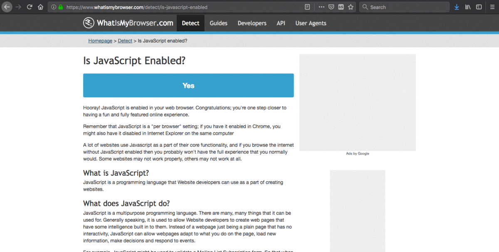

# bScript 

This Add-on works by blocking the operation of JavaScript in your browser, you can also block elements of the page. The recommendation is not to enable JavaScript for all pages. This Add-on launches the tab with JavaScript enabled, because some pages may not load correctly. The recommended is to disable JavaScript as soon as possible on the page by clicking the Add-on icon, the preference will be saved for the next visit.

## Requirements
* Firefox 58.0 or later

## Features
The Add-on currently has the following features:

1. Block Ads with the Block Element option

2. Block JavaScript by Tab

3. See the Blocked Elements in the page

4. Unblock Elements in the page

## Shortcuts
1. Block Element: Alt+B

2. See Blocked Elements: Alt+U

3. Unblock Elements: Alt+L

## How Contribute
Have a suggestion, doubt or encountered an error? Please open a new [issue](https://github.com/jhonatasrm/bScript/issues).

Contributions are welcome, feel free to submit a pull. :)

### Bitcoin (BTC)
[bc1qkxka7h3rxhejefyjp30agzywpyt2hw9manscyw](https://www.blockchain.com/btc/address/bc1qkxka7h3rxhejefyjp30agzywpyt2hw9manscyw)
### Litecoin (LTC)
LKzFPwvhxCfiXYmQbc1huu75jxsTmmEXbG

## Learn More
To learn more about webextensions development, see this [Mozilla developer Network documentation](https://developer.mozilla.org/en-US/Add-ons/WebExtensions).

### License
This repository is available under the [Mozilla Public License, version 2.0](https://github.com/jhonatasrm/bScript/blob/master/LICENSE).
